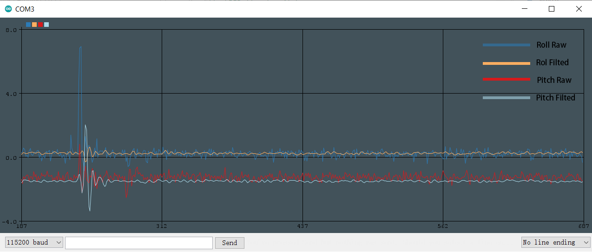

# FIR and IIR digital Filter

## 1. Preview

Typically, FIR and IIR Filter are mostly used digital filter. Image below is Roll and Pitch raw and filted data. We can find that filted data is more smooth and can filt high frequency peak mostly.

With digial Filter, data is more stable and useful for processing. In my opinion, FIR filter is much better than IIR filter, but FIR filter **comsumes more computing power**.



But there is also another drawback of FIR Filter, which is that it's filter is **lagged** after raw data, higher frequeny, more lagger data processing.

You can clearly find it in below picture.


All in all, filted is more useful when you counter some external disturbence.

## 2. FIR and IIR Online Designer

There are plenty of FIR online desinger if you google it. What I like most is [TFilter](http://t-filter.engineerjs.com). You can specify your designs in This website. For example, my sampling rate is 100Hz, and my desired frequency is 5 Hz, I want to cutoff 25-50Hz, after clicking `DESIGN FILTER` I get my filter taps.


Generated filter taps are use for FIR Filter.

## 3. FIR Filter

You can directly use FIR Libarary for you application, which I referred from [Phil’s Lab](https://www.youtube.com/channel/UCVryWqJ4cSlbTSETBHpBUWw) who did a great job on **Control System**.

### 3.1 Incude FIRFilter Library

First you need to include FIRFilter in your project.

```c
#include "FIRFilter.h"
```

Then you need to define a data buffer for storing your data and an arrey of your coefficent taps.

```c
float buffer[9] = { 0 };
float coeff[] = {
    0.02341152899192398, 0.06471122356467367, 0.12060371719780817,
    0.16958710211144923, 0.1891554348168665, 0.16958710211144923,
    0.12060371719780817, 0.06471122356467367, 0.02341152899192398
};
```

And you need to clear a **FIRFilter** struct and pass above two arrey to it.

```c
FIRFilter FIR;
FIRFilter_Init(&FIR, coeff, buffer, sizeof(coeff)/sizeof(float));
```

After all of this, you can now use FIRFilter in your project. For example, I need to filter my Roll data, I can do below.

```c
char message[50] = { 0 };
float roll = MPU_GetRoll();
FIRFilter_Update(&FIR, roll);
sprintf(message, "%.2f\t%.2f\r\n", roll, FIR.out);
HAL_UART_Transmit(&huart1, (uint8_t*) message, sizeof(message), 10);
```

You can call you filted data by using `FIR.out`;

Happy Coding!
