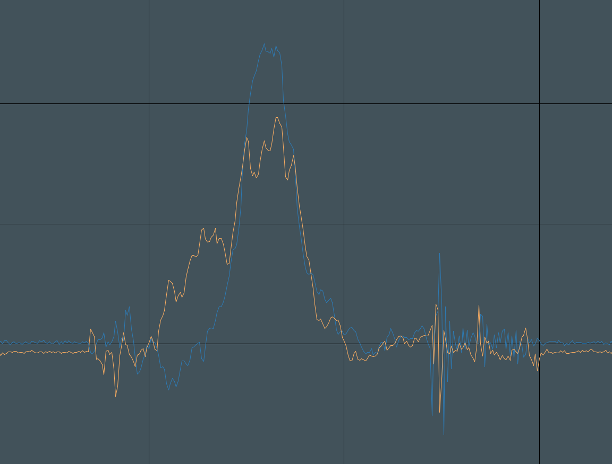
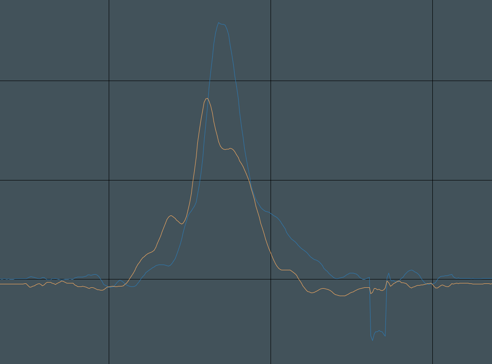
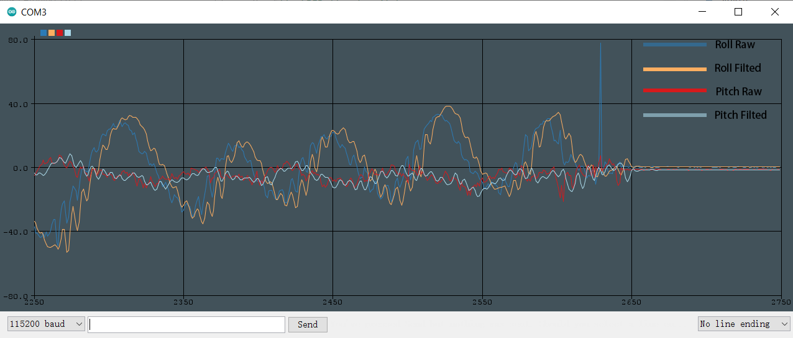
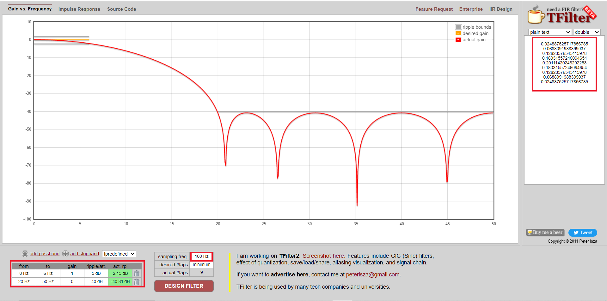

# Digital Filter

## 1. Preview

Typically, we use **Digital Filter** to process digital signal and sensor data, smoothing or filting data. There are many digital filting algorithm, most popular filters are:

- **FIR Filter**
- **MAF Filter**
- **IIR Filter**

FIR Filter is more powerful than MAF and IIR filter, abeling to **stablizie**, **smooth**, and **filt** data, but it comsumes more computing power.

MAF Filter is a simplified FIR Filter that only averaging your singal data, but it's still working very well.

IIR Filter is much more faster, but it's less powerfull than FIR and MAF Filters.

Image below is raw roll and pitch data from MPU6050.



After filting using MAF Filter, data signal looks like below, and the result is promising.



## 2. Drawbacks

The biggest problem of FIR Filte is that filter will cause **lagging** data. Higher frequeny, more lagger data processing.

You can clearly see it showing below.



Lagging problem is less if you're using MAF or IIR Filters. All in all, sensor fusing is really important.

## 3. FIR Filter

### 3.1 FIR Online Designer

FIR Filter is the most difficult Filters comparing with MAF and IIR Filters, you need to calculating your own filter taps. We often using programmes or Online Designers to do this job.

There are plenty of FIR online desingers if you google it. What I using is [TFilter](http://t-filter.engineerjs.com). You can specify your design needs on this website. For example, my sampling rate is 100Hz, and my desired frequency is 5 Hz, I want to cutoff 25-50Hz signal, after clicking `DESIGN FILTER` I get my filter taps.



Generated filter taps are use for FIR Filter Implement after.

### 3.2 FIR Filter Implement

You can directly use FIR Libarary for you own application, which I referred from [Phil’s Lab](https://www.youtube.com/channel/UCVryWqJ4cSlbTSETBHpBUWw) who did a great job on **Control System**.

First you need to include FIRFilter in your project.

```c
#include "FIRFilter.h"
```

Then you need to define a data buffer for storing your data and an arrey of your filter taps.

```c
float buffer[9] = { 0 };
float taps[] = {
    0.02341152899192398, 0.06471122356467367, 0.12060371719780817,
    0.16958710211144923, 0.1891554348168665, 0.16958710211144923,
    0.12060371719780817, 0.06471122356467367, 0.02341152899192398
};
```

And you need to declear a **FIRFilter** struct and pass above two arreies to it.

```c
FIRFilter FIRRoll;
FIRFilter_Init(&FIRRoll, taps, buffer, sizeof(taps)/sizeof(float));
```

After all of this, you can now use FIR Filter in your project. For example, if I need to filter my Roll data, I can do below.

```c
char message[50] = { 0 };
float roll = MPU_GetRoll();
float rollFilted = FIRFilter_Update(&FIRRoll, roll);
sprintf(message, "%.2f\t%.2f\r\n", roll, rollFilted);
HAL_UART_Transmit(&huart1, (uint8_t*) message, sizeof(message), 10);
```

## 4. MAF Filter

MAF Filter usage is much more easier than FIR Filter, you do not need to design filter taps, because you are averaging your data.

So you just need to including MAFFilter libaray, declear a MAFFilter struct and initilize MAF Filter.

```c
#include "MAFFilter.h"
MAFFilter MAFRoll;
MAFFileter_Init(&MAFRoll);
```

After that, you can using MAF Filter just like before.

```c
char message[50] = { 0 };
float roll = MPU_GetRoll();
float rollFilted = MAFFilter_Update(&MAFRoll, roll);
sprintf(message, "%.2f\t%.2f\r\n", roll, rollFilted);
HAL_UART_Transmit(&huart1, (uint8_t*) message, sizeof(message), 10);
```

## 5. IIR Filter

IIR Filter is as easy as MAF Filter, you just need to specify **alpha** you want to use for your filting.

```c
#include "IIRFilter.h"
IIRFilter IIRRoll;
IIRFilter_Init(&IIRRoll, 0.5);
```

Then using IIR Filter.

```c
char message[50] = { 0 };
float roll = MPU_GetRoll();
float rollFilted = IIRFilter_Update(&IIRRoll, roll);
sprintf(message, "%.2f\t%.2f\r\n", roll, rollFilted);
HAL_UART_Transmit(&huart1, (uint8_t*) message, sizeof(message), 10);
```

Happy Coding!
